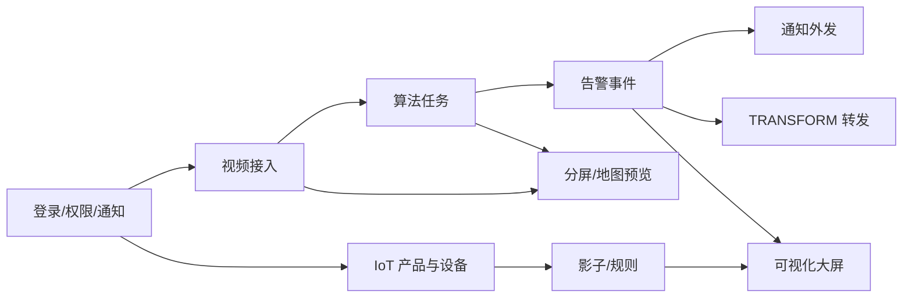

# 00 · 操作链总览

## 1. 一张图看懂平台闭环

**业务一句话：** 设备（摄像头或传感器）进平台 → AI/规则研判 → 告警与证据 → 通知或推给外部系统 / 上墙展示。

---

## 2. 六条核心操作链

| 链 | 一句话目标 | 主入口菜单 | 详文 |
|----|------------|------------|------|
| A 底座 | 能登录、有权限、告警能外发 | 系统管理 / 通知管理 | [01](./01-登录与基础准备.md) |
| B 视频 | 摄像头在线可播 | 流媒体管理 | [02](./02-视频设备接入.md) |
| C AI | 检出 → 告警 → 取证 | 流媒体管理 → 算法任务；告警事件 | [03](./03-AI算法任务闭环.md) |
| D IoT | 测点上线、影子可见 | 产品管理 / 设备管理 | [04](./04-物联网设备接入.md) |
| E 联动 | 告警触达人 / 外部系统 | 通知管理 / 数据转发 | [05](./05-告警通知与对外联动.md) |
| F 展示 | 指挥大屏上墙 | 可视化管理 / 首页 | [06](./06-可视化大屏.md) |

移动值守对照见 [07](./07-APP移动值守.md)。

---

## 3. 侧栏菜单速查（业务相关）

| 菜单 | 典型路径 | 在哪条链用 |
|------|----------|------------|
| 首页 | `/dashboard/index` | 指挥大屏、平台标识 |
| 流媒体管理 | `/camera/index` | 视频接入、推流、算法任务 |
| 产品管理 | `/product` | IoT 产品模板 |
| 设备管理 | `/device` | IoT 设备台账 |
| 数据标注 | `/dataset` | 数据集与标注 |
| 模型训练 / 模型管理 | `/train/index` | 训练与模型 |
| 告警事件 | `/alert` | AI/视频告警处置 |
| 通知管理 | `/notice` 或消息相关菜单 | 多渠道推送 |
| 数据转发 | `/transform/index` | TRANSFORM |
| 可视化 / 可视化管理 | `/visualize` | 大屏与组态 |
| 集群管理 | `/node/index` | 算力节点（扩容场景） |
| 规则引擎 | `/rulechains` | IoT 规则编排 |
| 系统管理 | `/system/...` | 租户、用户、角色、部门 |

> 侧栏由后端菜单权限下发；若某项不可见，先查角色权限。

---

## 4. 流媒体管理页内 Tab（视频主战场）

进入 **流媒体管理** 后，常见 Tab：

| Tab | 用途 |
|-----|------|
| 地图分布 | 摄像头空间布点、按区域看状态 |
| 分屏监控 | 多路预览；可勾选「启用 AI」看带框流 |
| 设备列表 | 添加/接入设备（ONVIF、NVR、国标、RTC、大疆等） |
| 推流转发 | 原画上墙、对外推流 |
| 算法任务 | 实时 / 抓拍 / 巡检任务 |
| 存储空间 | 抓拍、录像等存储 |
| 人脸库 / 车牌库 | 比对库（按部署开启） |

---

## 5. 按场景选链（快速导航）

| 现场要什么 | 怎么走 |
|------------|--------|
| 只看画面 | 链 B：接入 → 分屏监控 |
| 要智能告警 | 链 B → 链 C |
| 告警要发企微/短信 | 先链 A 通知底座 → 链 C → 链 E |
| 电表/PLC 上云 | 链 D（云端轮询或 EDGE） |
| 告警推 MES/ERP | 链 C → 链 E（TRANSFORM） |
| 指挥中心上墙 | 链 B/C/D → 链 F |
| 手机值守 | 链 B/C 配好后用 [APP](./07-APP移动值守.md) |

---

## 6. 最短验收清单（PoC 当天）

- [ ] `admin` 可登录，侧栏可见流媒体 / 告警
- [ ] 至少 1 路摄像头在线可播
- [ ] 至少 1 个算法任务运行中
- [ ] 人为触发或等待检出后，**告警事件**有记录与抓拍图
- [ ] （可选）通知历史有一条推送成功
