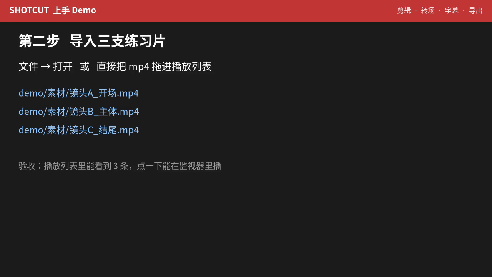
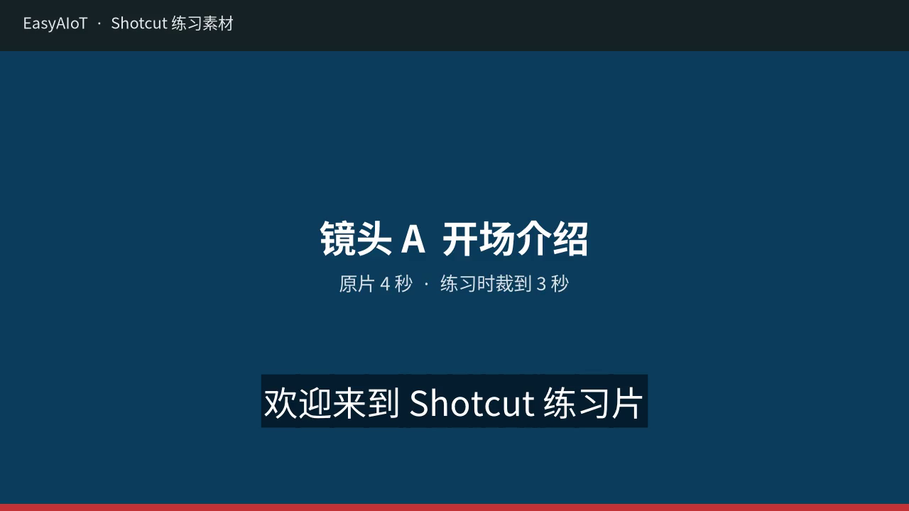

# 视频操作（Shotcut）

面向要把监控回放、告警片段、演示片做成可分享成片的人。工具用 **Shotcut**（免费、开源、跨平台）。

本目录只教一件事：**把几段素材剪成一条片子，配上字幕，导出 MP4。**

---

## 怎么用这套材料

| 顺序 | 打开什么 | 干什么 |
|------|----------|--------|
| 1 | [01-安装与启动.md](./01-安装与启动.md) | 确认本机已能打开 Shotcut |
| 2 | [04-动手Demo.md](./04-动手Demo.md) + [demo/输出/操作演示_跟着做.mp4](./demo/输出/操作演示_跟着做.mp4) | 先看 2 分钟演示，再对着做 |
| 3 | [02-界面与基础剪辑.md](./02-界面与基础剪辑.md) | 卡住时查：导入、裁剪、转场 |
| 4 | [03-字幕与导出.md](./03-字幕与导出.md) | 卡住时查：SRT、烧录、导出 |

练习文件都在 [demo/](./demo/)：

```text
demo/
  练习工程_从这里开始.mlt      Shotcut 打开即可（A+B+C 未裁剪）
  素材/镜头A_开场.mp4         蓝底 4 秒
  素材/镜头B_主体.mp4         绿底 6 秒
  素材/镜头C_结尾.mp4         橙底 4 秒
  字幕.srt                   三句中文字幕
  输出/操作演示_跟着做.mp4     2 分钟步骤演示
  输出/成品参考_已剪辑配字幕.mp4
```

目标成片：**三段按 A→B→C 接好，裁到约 9–10 秒，底部有中文字幕。**

演示片（先看这个）：



成品参考（字幕已烧进画面）：



---

## 最短操作链

```text
打开 Shotcut → 导入三支素材 → 拖到时间线 V1
    → I/O 或拖边缘裁时长 →（可选）重叠 0.5 秒做溶解
    → 视图·字幕 → 导入 srt → 滤镜「字幕烧录」
    → 导出 MP4
```
