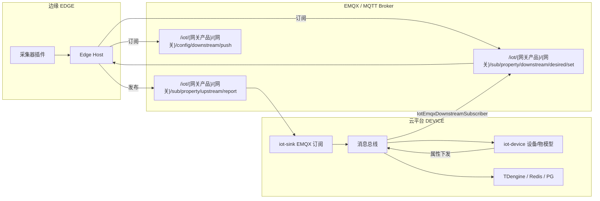

# EasyAIoT EDGE × DEVICE 平台对接指南

本文说明 Edge C# 采集器与 EasyAIoT 云平台（`iot-sink` / `iot-device`）之间的 MQTT 数据流、前置配置与联调方法。

## 1. 总体链路



### 上行（Edge → 云）

| 步骤 | 组件 | 说明 |
|------|------|------|
| 1 | Edge Host | 采集完成后发布 JSON |
| 2 | EMQX | Topic：`/iot/{网关产品}/{网关设备}/sub/property/upstream/report` |
| 3 | `IotEmqxUpstreamHandler` | 订阅 `/iot/#`，解码消息 |
| 4 | `GatewaySubDeviceSupport` | 解析 `productIdentification` + `deviceIdentification`，自动创建/绑定 SUBSET 子设备 |
| 5 | `PropertyUpstreamReportListener` | `DeviceDataStorageService` 写入 PG 影子、TDengine、Redis |
| 6 | `RemoteDeviceService` | 阈值评估 → 告警 |

### 下行（云 → Edge）

| 步骤 | 组件 | 说明 |
|------|------|------|
| 1 | WEB / API | 对子设备执行「属性设置」 |
| 2 | `DeviceServiceImpl.setProperties` | 组装 Topic：`/iot/{网关产品}/{网关}/sub/property/downstream/desired/set` |
| 3 | `IotDownstreamMessageApiImpl` | 投递到消息总线 |
| 4 | `IotEmqxDownstreamSubscriber` | 编码 payload 并 `publish` 到 EMQX |
| 5 | Edge Host | 订阅并执行写操作，回执 `property/upstream/desired/set/ack` |

## 2. 平台侧前置配置

### 2.1 启用 EMQX 接入（iot-sink）

`DEVICE/iot-sink/iot-sink-biz/src/main/resources/application-local.yaml`：

```yaml
basiclab:
  iot:
  gateway:
    protocol:
      emqx:
        enabled: true
        mqtt-host: localhost
        mqtt-port: 1883
        mqtt-topics:
          - "/iot/#"
          - "/shadow/#"
```

Docker 部署时确认 `DEVICE/docker-compose.yml` 中 EMQX 已启动，且 `iot-sink` 的 `BASICLAB_IOT_SINK_PROTOCOL_EMQX_MQTT_HOST` 指向 Broker。

### 2.2 创建产品与设备

在 WEB「产品管理」中创建两类产品：

| 产品类型 | 用途 | 示例标识 |
|---------|------|---------|
| **GATEWAY** | 边缘网关本体 | `edge-gateway-product` |
| **SUBSET** | 网关下挂子设备 | `edge-subset-product` |

在「设备管理」中：

1. 新建 **网关设备**（类型 GATEWAY），标识如 `gateway-demo-001`
2. （可选）预先创建子设备；也可由 Edge 首次上报时 **自动建档**

Edge `appsettings.json` 中网关标识必须与平台一致：

```json
{
  "Edge": {
    "Gateway": {
      "ProductIdentification": "edge-gateway-product",
      "DeviceIdentification": "gateway-demo-001"
    },
    "Mqtt": {
      "Host": "127.0.0.1",
      "Port": 1883
    }
  }
}
```

### 2.3 子设备物模型

在 SUBSET 产品下定义属性（与 Edge 上报字段一致），例如：

- `temperature`（float）
- `humidity`（float）
- `pressure`（float）

未定义的字段可能被存储层忽略或告警。

## 3. Edge 侧配置要点

### 3.1 网关代报 payload 格式（与 iot-sink 对齐）

子设备上报时，Edge 发送：

```json
{
  "id": "...",
  "method": "thing.event.property.post",
  "params": {
    "productIdentification": "edge-subset-product",
    "deviceIdentification": "sensor-demo-001",
    "properties": {
      "temperature": 25.3,
      "humidity": 60.1
    }
  }
}
```

任务配置中需指定：

- `subDeviceIdentification`：子设备标识
- `subProductIdentification`：SUBSET 产品标识

### 3.2 云端下发采集任务

Topic：`/iot/{网关产品}/{网关}/config/downstream/push`

```json
{
  "method": "thing.config.push",
  "params": {
    "edgeJobs": [
      {
        "jobId": "job-001",
        "subDeviceIdentification": "sensor-demo-001",
        "subProductIdentification": "edge-subset-product",
        "collectorId": "demo-simulator",
        "intervalSeconds": 10,
        "protocolConfig": { "type": "demo", "pollIntervalMs": 10000 }
      }
    ]
  }
}
```

字段与 DEVICE 侧 `IndustrialDeviceConfig` 兼容，详见 `configs/cloud-config-push.example.json`。

## 4. 联调脚本

### 4.1 独立环境（自带 Mosquitto）

```bash
bash EDGE/demo/run_e2e.sh
```

### 4.2 对接平台 EMQX

```bash
export EDGE_MQTT_HOST=127.0.0.1
export EDGE_MQTT_PORT=1883
export EDGE_PRODUCT=edge-gateway-product
export EDGE_GATEWAY=gateway-demo-001

bash EDGE/demo/run_platform_smoke.sh
```

### 4.3 仅监听 MQTT（验证 iot-sink 是否收到）

```bash
EDGE_MQTT_PORT=1883 bash EDGE/demo/mqtt_subscribe_uplink.sh
```

## 5. 验收清单

| 检查项 | 预期 |
|--------|------|
| Edge 连接 EMQX | 日志：`MQTT connected` |
| 配置下发 | Edge 日志：`Config pushed from cloud` |
| 属性上行 | `mqtt_subscribe` 可见 `sub/property/upstream/report` |
| iot-sink 日志 | `sendDeviceMessage`、`storeDeviceData` |
| WEB 设备详情 | 子设备在线，属性实时更新 |
| WEB 属性设置 | Edge 回执 `code: 0`，`desired/set/ack` |
| TDengine | 历史曲线有数据（full 部署） |

## 6. 常见问题

### 上行无数据 / 设备未创建

- 检查 payload 是否包含 **`productIdentification` + `deviceIdentification`**（不是仅有 `subDeviceIdentification`）
- SUBSET 产品必须已在平台创建
- 查看 `iot-sink` 日志：`rewriteToSubDevice`、`ensureSubDevice`

### 下行不到 Edge

- 确认 `iot-sink` EMQX 协议 `enabled: true`
- 确认 `IotEmqxDownstreamSubscriber` 已注册（启动日志）
- WEB 下发子设备属性时 Topic 应为网关的 `sub/property/downstream/desired/set`
- Edge 需订阅该 Topic（已内置）

### 物模型校验失败

- 属性 identifier 与物模型定义一致（大小写敏感）
- 数值类型与物模型 dataType 匹配

## 7. 相关代码索引（DEVICE 模块）

| 能力 | 类 / 路径 |
|------|-----------|
| EMQX 上行入口 | `IotEmqxUpstreamHandler` |
| EMQX 下行桥接 | `IotEmqxDownstreamSubscriber` |
| 子设备代报解析 | `GatewaySubDeviceSupport` |
| 属性入库 | `PropertyUpstreamReportListener` → `DeviceDataStorageService` |
| WEB 属性下发 | `DeviceServiceImpl.setProperties` |
| Topic 定义 | `IotDeviceTopicEnum` |
| 工业协议配置 | `IndustrialDeviceConfig` |

## 8. Edge 模块索引

| 能力 | 路径 |
|------|------|
| MQTT 客户端 | `EasyAIoT.Edge.Mqtt/Client/MqttEdgeClient.cs` |
| 配置解析 | `EasyAIoT.Edge.Core/Config/ConfigDownstreamParser.cs` |
| 运行时 | `EasyAIoT.Edge.Core/Hosting/EdgeRuntimeService.cs` |
| 联调 Demo | `EDGE/demo/` |
